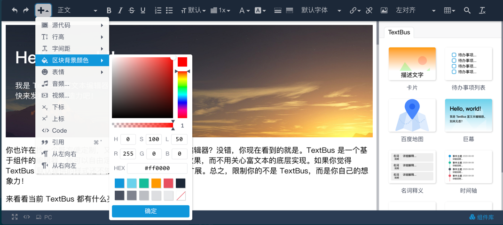

TextBus 富文本编辑器
================================

> 最新公告：
>
> TextBus 2.0 正在紧锣密鼓的开发中，近期即将开始内测，提供更好的组件开发体验，更简単的 API 接口，更高的性能，以及协同文档的支持，欢迎大家持续关注！

TextBus 是一个通过自建数据模型、内置 Diff 算法、以数据为核心驱动的富文本编辑器。

同时，TextBus 拥有非常好的可扩展性和定制能力，你可以基于 TextBus 的数据模型扩展自己的组件（Component）、格式（Formatter）及工具。当然，内置的组件、格式、工具、插件等，你也可以随意添加和删除。甚至，你也可以把 TextBus 当成一个源码生成器，通过定制组件的 `render`
方法，输出 Vue、React 或 Angular 的模板源代码。因此 TextBus 拥有类似于建站工具的能力。



## 安装

通过 npm 安装 TextBus：
```bash
npm install @textbus/textbus
```

在 html 中准备一个空的元素
```html
<body>
  <div id="editor"></div>
</body>

```

通过 css 选择器，或直接传入一个 DOM 元素初始化 TextBus。
```typescript
import { createEditor } from '@textbus/textbus';
import { Observable } from 'rxjs';

const editor = createEditor('#editor', {
  uploader(type: string): string | Promise<string> | Observable<string> {
    // switch (type) {
    //   case 'video':
    //     console.log('上传视频');
    //     break;
    //   case 'image':
    //     console.log('上传视频');
    //     break;
    //   case 'audio':
    //     console.log('上传音频');
    //     break;
    // }
    return Promise.resolve().then(() => {
      return '/test'
    })
  },
  content: `<p>欢迎你使用&nbsp;<strong>TextBus</strong> 富文本编辑器...<br></p>`
});

editor.onChange.subscribe(() => {
  console.log(editor.getContents());
});
```
## 官网地址
[TextBus 官网](https://textbus.tanboui.com)

如果在官网还不能找到你想了解的问题，你可以加入 TextBus 的官方 QQ 群：786923770。你也可以直接扫码加入：


## 赞助

TextBus 的成长离不开社会的支持，如果 TextBus 为你带来了帮助，并且你也认同为知识付费，同时鼓励我们做的更好，欢迎通过下面的二维码表达你的支持

 

## 为什么要开发 TextBus？

众所周知，富文本编辑器一直是前端开发领域的一个天坑。但同时市面上的富文本编辑器却又数不胜数，那为什么我还要另起炉灶呢？

1. 目前大多数富文本内容都太脏了，比如，加粗一段文字，可能是一个 strong 标签，也有可能是多个，如果这段文字同时还有其它格式，那么就更热闹了，基本处于一个不可控的状态。能把显示状态和编辑处理成正常的，就算很不错的编辑器，基本不会管内容脏不脏的问题。
2. 目前比较新的编辑器，基本都有自己的一套抽象数据结构来描述富文本，这同时又引起了另一个问题，即这一数据结构对有的富文本内容描述不了，导致要扩展特定的格式不能实现。
3. 部分富文本编辑器依赖特定的框架或库，造成使用上的限制。
4. 扩展困难，不能方便的扩展格式、组件和模板，也不方便定制特定的编辑行为。
5. 实时的代码高亮，这个对程序员写文档来说，是一个比较重要的功能。
6. 对于粘贴进来的内容，要么粗爆的只是提取文本内容，导致格式丢失。要么就直接扔进页面，产生非常多的脏数据（如粘贴 word 的内容），虽然有的编辑器做了过滤，但基本不能做到完全剔除脏数据。
7. 粘贴进来的资源不能触发上传行为。


对于以上所列举的只是部分问题，有问题虽然不好，但也不完全是坏事，这时就需要 TextBus 来解决这些问题。针对上面的问题，TextBus 解决如下：

1. TextBus 输出非常干净，没有冗余的标签及样式。
2. TextBus 没有定义一个标准的数据结构，只抽象出了 Formatter（格式） 和 Component（组件）两个维度的数据来格式化富文本的 Content（内容）。现在大家日常基本都是组件化开发，TextBus 也有自己的组件，你可以像写 Vue/React/Angular 组件一样，来写 TextBus 的组件，只要你愿意，没有什么效果是实现不了的。
3. TextBus 不依赖特定的库，开箱即用。
4. TextBus 扩展真的很简单，如果你使用 Typescript 开发的话，IDE 会给你非常好的代码提示，你只需要实现对应的接口，其它的就交给 TextBus 帮你处理。
5. 实时代码高亮，在 TextBus 里真的不是问题。
6. 由于 TextBus 的架构设计天然的支持过滤脏内容，所以，当粘贴进 TextBus 不认识的数据时，会自动忽略掉，而不会遗留在最终的结果里。
7. 粘贴进来的资源上传，会自动分析，并触发上传。


当然，除了上述列举的问题，其实大家可能还有更多的需求亟待解决，这里就不一一阐述了，欢迎大家试用，并给出评价。更欢迎提出问题，要是能一起来完善 TextBus，那就更好了！

## 开发环境

对于一部分需要更详细了解 TextBus 原理，需要本地调试的开发者来说，可以通过以下方式在本地运行 TextBus。

TextBus 采用 lerna 作为多模块管理工具。如果你没有安装，请先安装 lerna。

```
npm install -g lerna
```

在项目根目录，通过 lerna 安装本地依赖

```
lerna bootstrap --hoist
```

启动项目

```
npm start
```

至此，你就可以在浏览器看到开发版本的 TextBus 效果了
